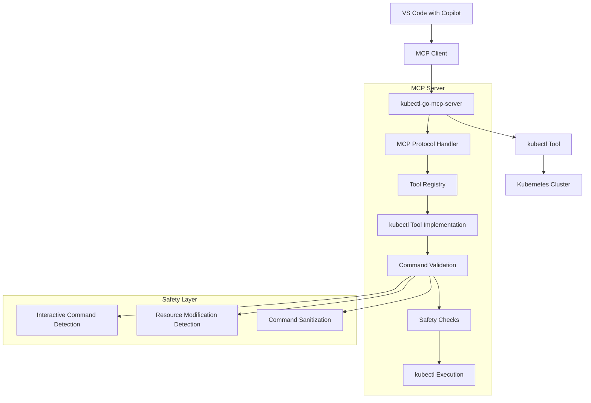

# Architecture

## High-Level Overview



## Core Components

### 1. **MCP Server Layer** (`internal/mcp/`)

- **Protocol Implementation**: Handles MCP JSON-RPC communication
- **Tool Management**: Registers and manages available tools
- **Request Processing**: Converts MCP tool calls to internal operations
- **Response Formatting**: Transforms command outputs to MCP-compatible responses

### 2. **Tool Implementation** (`pkg/kubectl/`)

- **kubectl Tool**: Primary tool for Kubernetes operations
- **Command Execution**: Safe execution of kubectl commands
- **Result Processing**: Structured output handling and error management

### 3. **Type System** (`pkg/types/`)

- **Tool Interface**: Common interface for all MCP tools
- **Schema Definitions**: JSON schema for tool parameters
- **Result Types**: Standardized command execution results

### 4. **Safety and Validation Layer**

```go
// Command flow through safety layers
Input Command
    ↓
Interactive Check (exec -it, edit, port-forward)
    ↓
Resource Modification Detection (get vs apply)
    ↓
Command Sanitization
    ↓
kubectl Execution
    ↓
Result Processing
```

## Data Flow

1. **Client Request**: VS Code/Copilot sends MCP tool call
2. **Protocol Handling**: MCP server receives and validates JSON-RPC request
3. **Tool Routing**: Request routed to appropriate tool (kubectl)
4. **Safety Validation**:
   - Interactive command detection
   - Resource modification classification
   - Input sanitization
5. **Command Execution**: kubectl command executed with proper context
6. **Result Processing**: Output structured and errors handled
7. **Response**: MCP-formatted response sent back to client

## Security Architecture

### Multi-Layer Protection

```
┌─────────────────────────────────────┐
│ Application Layer                   │
│ ┌─────────────────────────────────┐ │
│ │ Interactive Command Blocking    │ │
│ └─────────────────────────────────┘ │
│ ┌─────────────────────────────────┐ │
│ │ Command Validation & Parsing    │ │
│ └─────────────────────────────────┘ │
│ ┌─────────────────────────────────┐ │
│ │ Resource Modification Detection │ │
│ └─────────────────────────────────┘ │
└─────────────────────────────────────┘
┌─────────────────────────────────────┐
│ kubectl Layer                       │
│ ┌─────────────────────────────────┐ │
│ │ Standard kubectl Security       │ │
│ └─────────────────────────────────┘ │
└─────────────────────────────────────┘
┌─────────────────────────────────────┐
│ Kubernetes RBAC                     │
└─────────────────────────────────────┘
```

### Safety Mechanisms

- **Non-Interactive Enforcement**: Automatically blocks commands that require user interaction
- **Command Classification**: Categorizes commands by their potential impact
- **Timeout Protection**: Prevents hanging on long-running operations
- **Error Isolation**: Contains and reports errors without exposing sensitive information

## Module Architecture

### Package Organization

```
├── cmd/                        # 🚀 Main application entry point (main.go)
├── pkg/                        # 📦 Exportable packages
│   ├── types/                  # 🔧 Shared types and interfaces
│   └── kubectl/                # 🎯 kubectl tool implementation
├── internal/                   # 🔒 Private application code
│   ├── config/                 # ⚙️ Configuration management
│   └── mcp/                    # 🌐 MCP server implementation
├── test/                       # 🧪 Integration tests
├── .github/                    # 📋 GitHub workflows and settings
├── .vscode/                    # 💻 VS Code configuration
├── bin/                        # 📁 Built binaries
└── docs/                       # 📚 Additional documentation
```

Each package follows Go best practices with clear separation of concerns and minimal dependencies between layers.
